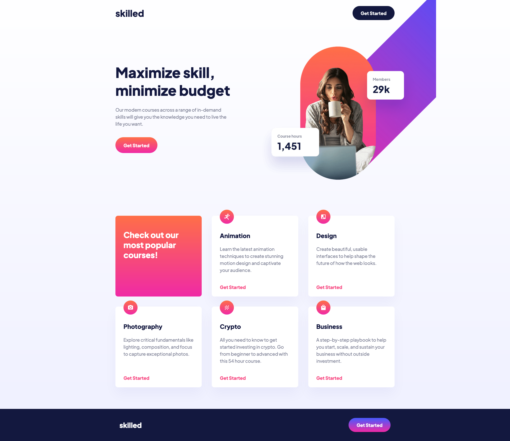
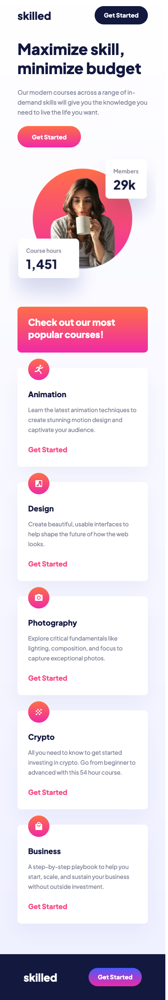

# Frontend Mentor - Skilled e-learning landing page solution

This is a solution to the [Skilled e-learning landing page challenge on Frontend Mentor](https://www.frontendmentor.io/challenges/skilled-elearning-landing-page-S1ObDrZ8q). Frontend Mentor challenges help you improve your coding skills by building realistic projects.

## Overview

### The challenge

Users should be able to:

- View the optimal layout depending on their device's screen size
- See hover states for interactive elements

### Screenshot

### Links

- Solution URL: [Github](https://github.com/darpots/fm_skilled-landing)
- Live Site URL: [Live Site](https://fm-skilled-landing.vercel.app)

### What I learned

Transitions on Gradients don't work out of the box, so you have to work around it using pseudo elements and z-index.

### Continued development

Still need to break down the design more into smaller chunks. Several times resulted in a small rewrite of code which wouldnt have happened had I spent another few moments looking at how to break it down.

## Author

- Website - [Darren Potter](https://www.darpots.dev)
- Frontend Mentor - [@darpots](https://www.frontendmentor.io/profile/darpots)
- Twitter - [@darpots](https://www.twitter.com/darpots)
